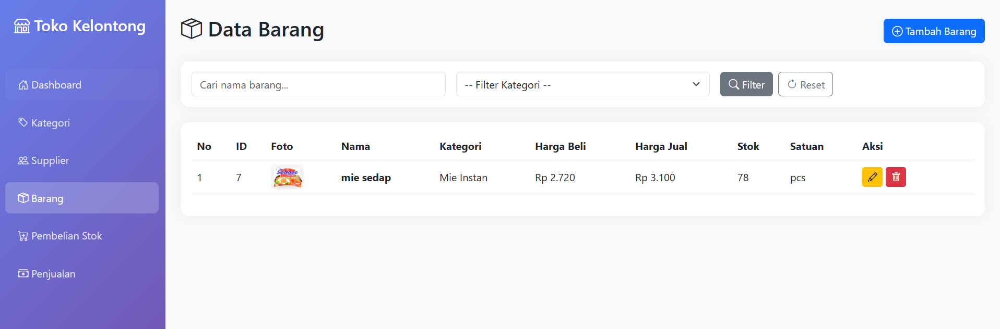
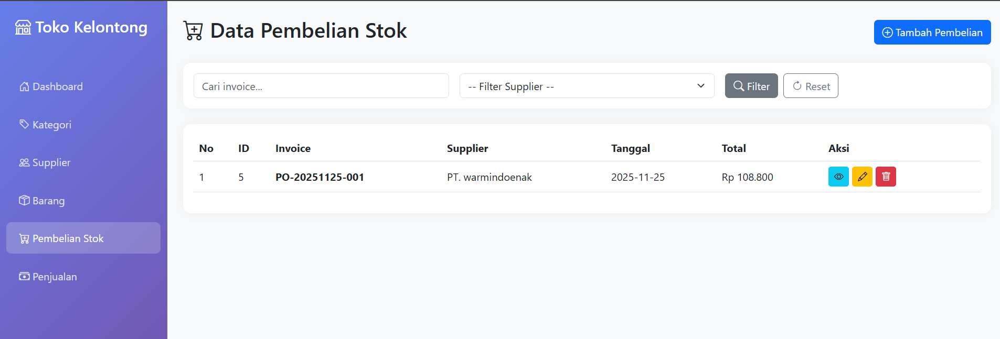
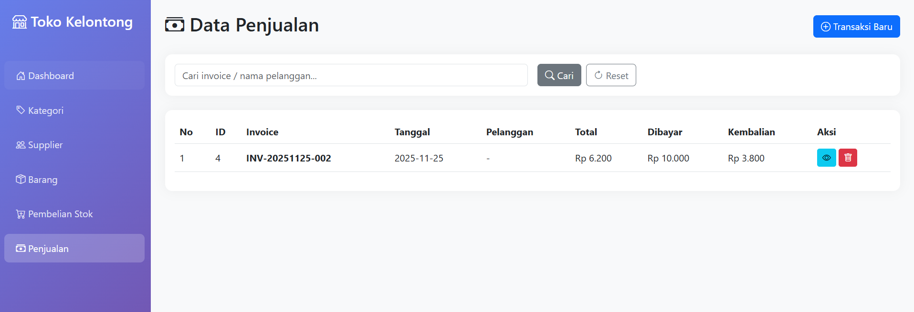

# 🏪 Sistem Informasi Toko Kelontong

Aplikasi web berbasis Laravel untuk mengelola operasional toko kelontong, mencakup manajemen inventori, supplier, kategori produk, transaksi pembelian stok, dan penjualan.

## 📋 Deskripsi

Sistem Informasi Toko Kelontong adalah aplikasi CRUD (Create, Read, Update, Delete) yang dirancang untuk memudahkan pengelolaan toko kelontong. Aplikasi ini dibangun menggunakan framework Laravel 10 dengan Blade templating engine, Bootstrap 5 untuk UI, dan MySQL sebagai database.

**Dibuat untuk memenuhi**: TUGAS 2 Pemrograman Web Semester Ganjil 2025/2026

## ✨ Fitur Utama

### 1. 📦 Manajemen Data Barang

-   ✅ Tambah barang baru dengan informasi lengkap (nama, kategori, harga beli/jual, stok, satuan)
-   ✅ Tampilkan daftar barang dalam tabel dengan kolom ID, foto, nama, kategori, harga, stok
-   ✅ Edit data barang (update harga, stok, foto)
-   ✅ Hapus barang dengan konfirmasi
-   ✅ Upload foto barang (validasi format: jpg, jpeg, png; maksimal 2MB)
-   ✅ Pencarian barang berdasarkan nama
-   ✅ Filter barang berdasarkan kategori

### 2. 🏢 Manajemen Supplier

-   ✅ Tambah supplier dengan data lengkap (nama, telepon, alamat, email)
-   ✅ Tampilkan list supplier dengan kolom ID, nama, telepon, alamat, email
-   ✅ Edit informasi supplier
-   ✅ Hapus supplier dengan konfirmasi
-   ✅ Pencarian supplier berdasarkan nama atau email

### 3. 🏷️ Kategori Barang

-   ✅ Tambah kategori produk (contoh: mie instan, minuman, rokok, sembako)
-   ✅ Tampilkan daftar kategori dengan ID dan deskripsi
-   ✅ Edit nama dan deskripsi kategori
-   ✅ Hapus kategori dengan konfirmasi
-   ✅ Pencarian kategori berdasarkan nama

### 4. 🛒 Transaksi Pembelian Stok

-   ✅ Catat pembelian barang dari supplier dengan nomor invoice otomatis
-   ✅ Input multi-item dalam satu transaksi (pilih barang, jumlah, harga)
-   ✅ Kalkulasi otomatis subtotal dan total pembelian
-   ✅ Riwayat pembelian dengan filter supplier dan pencarian invoice
-   ✅ Detail pembelian dengan tabel barang yang dibeli
-   ✅ Edit transaksi pembelian (update barang, jumlah, harga)
-   ✅ Hapus transaksi dengan konfirmasi dan rollback stok
-   ✅ Stok barang otomatis bertambah saat pembelian

### 5. 💰 Sistem Kasir Penjualan

-   ✅ Input transaksi penjualan dengan nomor invoice otomatis
-   ✅ Input multi-item dalam satu transaksi
-   ✅ Validasi stok (tidak bisa menjual melebihi stok tersedia)
-   ✅ Kalkulasi otomatis total, uang dibayar, dan kembalian
-   ✅ Riwayat transaksi penjualan dengan pencarian
-   ✅ Detail transaksi dengan tabel barang yang terjual
-   ✅ Hapus transaksi dengan konfirmasi dan restore stok
-   ✅ Stok barang otomatis berkurang saat penjualan

### 6. 🎯 Fitur Bonus (Nilai Tambahan)

-   ✅ Upload dan preview foto barang
-   ✅ Validasi numerik untuk harga dan stok
-   ✅ Validasi stok tidak boleh minus
-   ✅ Filter dan pencarian di berbagai modul
-   ✅ Pagination dengan query string preservation
-   ✅ Konfirmasi hapus dengan pesan spesifik (menyebut nama/invoice)
-   ✅ Error handling pada transaksi (try-catch dengan pesan user-friendly)
-   ✅ Auto-generate nomor invoice (format: INV-YYYYMMDD-XXX, PO-YYYYMMDD-XXX)
-   ✅ Prepared statements (via Eloquent ORM)

## 🗂️ Struktur Folder

```
toko_kelontong/
├── app/
│   ├── Http/
│   │   └── Controllers/
│   │       ├── CategoryController.php      # CRUD Kategori
│   │       ├── SupplierController.php      # CRUD Supplier
│   │       ├── ProductController.php       # CRUD Produk + Upload Gambar
│   │       ├── PurchaseController.php      # CRUD Pembelian Stok
│   │       └── SaleController.php          # CRUD Penjualan
│   └── Models/
│       ├── Category.php                    # Model Kategori
│       ├── Supplier.php                    # Model Supplier
│       ├── Product.php                     # Model Produk
│       ├── Purchase.php                    # Model Pembelian
│       ├── PurchaseDetail.php              # Detail Pembelian
│       ├── Sale.php                        # Model Penjualan
│       └── SaleDetail.php                  # Detail Penjualan
├── database/
│   └── migrations/
│       ├── 2024_01_01_000001_create_categories_table.php
│       ├── 2024_01_01_000002_create_suppliers_table.php
│       ├── 2024_01_01_000003_create_products_table.php
│       ├── 2024_01_01_000004_create_purchases_table.php
│       ├── 2024_01_01_000005_create_purchase_details_table.php
│       ├── 2024_01_01_000006_create_sales_table.php
│       └── 2024_01_01_000007_create_sale_details_table.php
├── resources/
│   └── views/
│       ├── layouts/
│       │   └── app.blade.php               # Layout utama (sidebar, navbar)
│       ├── categories/                     # View CRUD Kategori
│       │   ├── index.blade.php
│       │   ├── create.blade.php
│       │   └── edit.blade.php
│       ├── suppliers/                      # View CRUD Supplier
│       │   ├── index.blade.php
│       │   ├── create.blade.php
│       │   └── edit.blade.php
│       ├── products/                       # View CRUD Produk
│       │   ├── index.blade.php
│       │   ├── create.blade.php
│       │   └── edit.blade.php
│       ├── purchases/                      # View CRUD Pembelian
│       │   ├── index.blade.php
│       │   ├── create.blade.php
│       │   ├── edit.blade.php
│       │   └── show.blade.php
│       └── sales/                          # View CRUD Penjualan
│           ├── index.blade.php
│           ├── create.blade.php
│           └── show.blade.php
├── routes/
│   └── web.php                             # Routing (Resource Routes)
├── storage/
│   └── app/
│       └── public/
│           └── products/                   # Folder upload foto produk
├── public/
│   └── storage -> ../storage/app/public    # Symlink untuk akses gambar
├── .env                                    # Konfigurasi database & environment
├── composer.json                           # Dependencies PHP
└── README.md                               # Dokumentasi ini
```

## 🛠️ Teknologi

-   **Framework**: Laravel 10
-   **Frontend**: Blade Templates + Bootstrap 5 + Bootstrap Icons
-   **Backend**: PHP 8.x
-   **Database**: MySQL
-   **ORM**: Eloquent (Prepared Statements)
-   **UI Library**: Bootstrap 5.3
-   **Icons**: Bootstrap Icons 1.11

## 📥 Instalasi & Cara Menjalankan

### Persyaratan Sistem

-   PHP >= 8.1
-   Composer
-   MySQL atau MariaDB
-   Web Server (Apache/Nginx) atau PHP Development Server
-   Git (untuk clone repository)

### Langkah Instalasi

#### 1️⃣ Clone Repositori

```bash
git clone https://github.com/irfandeny/toko_kelontong.git
cd toko_kelontong
```

#### 2️⃣ Install Dependencies

```bash
composer install
```

#### 3️⃣ Konfigurasi Environment

```bash
# Copy file .env.example menjadi .env
cp .env.example .env

# Generate application key
php artisan key:generate
```

#### 4️⃣ Konfigurasi Database

Edit file `.env` dan sesuaikan dengan konfigurasi database Anda:

```env
DB_CONNECTION=mysql
DB_HOST=127.0.0.1
DB_PORT=3306
DB_DATABASE=toko_kelontong
DB_USERNAME=root
DB_PASSWORD=
```

**Untuk Laragon:**

```env
DB_CONNECTION=mysql
DB_HOST=127.0.0.1
DB_PORT=3306
DB_DATABASE=toko_kelontong
DB_USERNAME=root
DB_PASSWORD=
```

**Untuk XAMPP:**

```env
DB_CONNECTION=mysql
DB_HOST=127.0.0.1
DB_PORT=3306
DB_DATABASE=toko_kelontong
DB_USERNAME=root
DB_PASSWORD=
```

#### 5️⃣ Buat Database

Buat database baru di MySQL dengan nama `toko_kelontong`:

```sql
CREATE DATABASE toko_kelontong;
```

Atau gunakan phpMyAdmin/HeidiSQL/MySQL Workbench.

#### 6️⃣ Jalankan Migrasi Database

```bash
php artisan migrate
```

Perintah ini akan membuat tabel-tabel:

-   `categories` - Data kategori
-   `suppliers` - Data supplier
-   `products` - Data barang
-   `purchases` - Header pembelian
-   `purchase_details` - Detail pembelian
-   `sales` - Header penjualan
-   `sale_details` - Detail penjualan

#### 7️⃣ Buat Symlink untuk Storage (Upload Gambar)

```bash
php artisan storage:link
```

Perintah ini membuat symlink `public/storage` → `storage/app/public` agar gambar produk bisa diakses via browser.

#### 8️⃣ Jalankan Aplikasi

```bash
php artisan serve
```

Aplikasi akan berjalan di: **http://127.0.0.1:8000**

#### 9️⃣ Akses Aplikasi

Buka browser dan akses:

```
http://127.0.0.1:8000
```

Atau jika menggunakan Laragon/XAMPP dengan virtual host:

```
http://toko_kelontong.test
```

## 🚀 Cara Menggunakan

### Menu Navigasi

-   **Dashboard**: Halaman utama
-   **Kategori**: Kelola kategori barang (Makanan, Minuman, Sembako, dll.)
-   **Supplier**: Kelola data supplier/pemasok
-   **Barang**: Kelola data produk (nama, harga, stok, foto)
-   **Pembelian Stok**: Catat pembelian barang dari supplier
-   **Penjualan**: Catat transaksi penjualan (kasir)

### Workflow Penggunaan

1. **Setup Awal**:

    - Tambahkan kategori (contoh: Makanan, Minuman, Sembako)
    - Tambahkan supplier (nama toko/distributor)

2. **Input Barang**:

    - Pilih menu **Barang** → **Tambah Barang**
    - Isi nama, pilih kategori, harga beli, harga jual, stok awal, satuan
    - Upload foto (opsional)

3. **Pembelian Stok**:

    - Pilih menu **Pembelian Stok** → **Tambah Pembelian**
    - Pilih supplier, tanggal
    - Klik **Tambah Baris** untuk menambah barang
    - Pilih barang, isi qty dan harga
    - **Stok otomatis bertambah** saat simpan

4. **Transaksi Penjualan**:

    - Pilih menu **Penjualan** → **Transaksi Baru**
    - Klik **Tambah Baris** untuk menambah barang
    - Pilih barang, isi qty (harga otomatis terisi)
    - Isi jumlah uang dibayar
    - **Stok otomatis berkurang** dan kembalian dihitung otomatis

5. **Laporan**:
    - Lihat riwayat pembelian di menu **Pembelian Stok**
    - Lihat riwayat penjualan di menu **Penjualan**
    - Gunakan fitur pencarian dan filter

## 🧹 Perintah Berguna Yang Sangat membantu jika ada kesalahan

```bash
# Clear cache
php artisan cache:clear
php artisan config:clear
php artisan route:clear
php artisan view:clear

# Refresh database (HATI-HATI: menghapus semua data)
php artisan migrate:fresh

# Membuat symlink storage (jika belum)
php artisan storage:link
```

## 👥 Tim Pengembang

Proyek ini dikembangkan oleh kelompok untuk memenuhi **TUGAS 2 Pemrograman Web Semester Ganjil 2025/2026**:

| Nama                     | NIM             | GitHub                                               |
| ------------------------ | --------------- | ---------------------------------------------------- |
| Irfan Deny               | 202310370311377 | [@irfandeny](https://github.com/irfandeny)           |
| Keysya Yesanti Safa'at   | 202310370311363 | [@keysyayst](https://github.com/keysyayst)           |
| Amalia Dinda Aprilliana  | 202310370311360 | [@aamaliadiin](https://github.com/aamaliadiin)       |
| Firman Maulana Bagaskara | 202310370311355 | [@Firman2244](https://github.com/Firman2244)         |
| Erlangga Rizky Ramadhani | 202310370311357 | [@YourMajesty186](https://github.com/YourMajesty186) |

## 📸 Screenshot

### Halaman Barang



### Halaman Pembelian Stok



### Halaman Penjualan



## 🐛 Troubleshooting

### Error "SQLSTATE[HY000] [1049] Unknown database"

-   Pastikan database `toko_kelontong` sudah dibuat
-   Cek konfigurasi `.env` (DB_DATABASE, DB_USERNAME, DB_PASSWORD)

### Gambar produk tidak muncul

```bash
# Buat symlink storage
php artisan storage:link

# Pastikan folder storage/app/public/products ada
mkdir -p storage/app/public/products
```

### Error "Class 'Storage' not found"

```bash
# Clear cache
php artisan config:clear
composer dump-autoload
```

## 📝 Lisensi

Proyek ini dibuat untuk keperluan akademik (Tugas Pemrograman Web C).

## 🤝 Kontribusi

Kontribusi, issues, dan feature requests sangat diterima!

1. Fork repository ini
2. Buat branch fitur (`git checkout -b feature/AmazingFeature`)
3. Commit perubahan (`git commit -m 'Add some AmazingFeature'`)
4. Push ke branch (`git push origin feature/AmazingFeature`)
5. Buat Pull Request

## 📞 Kontak

Untuk pertanyaan atau saran, silakan:

-   Buka [GitHub Issues](https://github.com/irfandeny/toko_kelontong/issues)
-   Atau hubungi salah satu anggota tim melalui GitHub

---

<div align="center">
Dibuat dengan ❤️ oleh Tim Kelompok Pemrograman Web 2025
</div>
